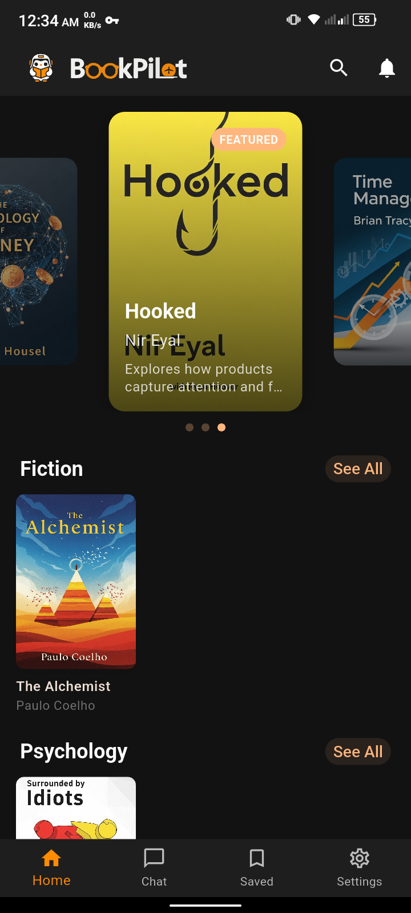
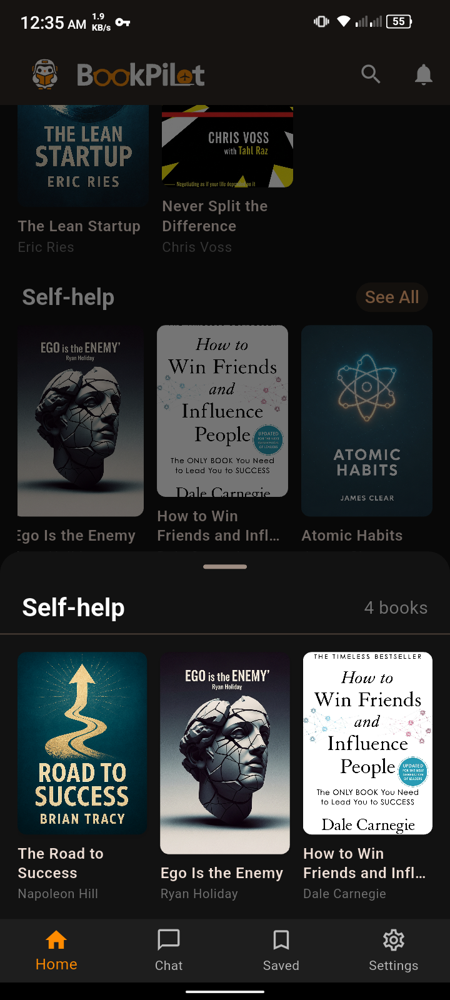
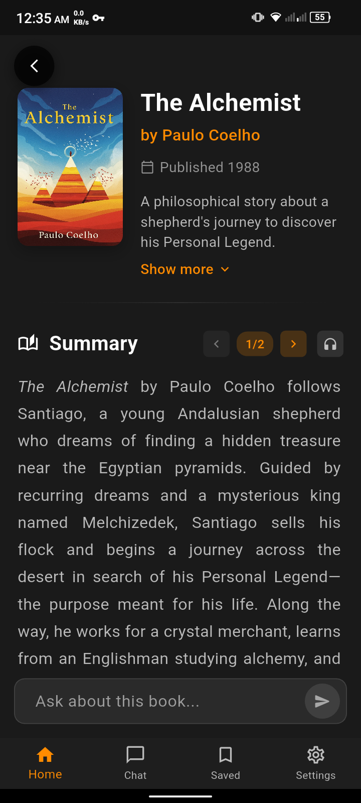
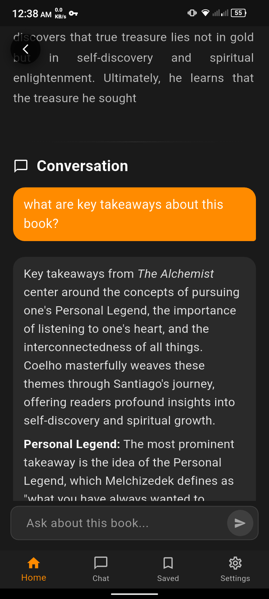
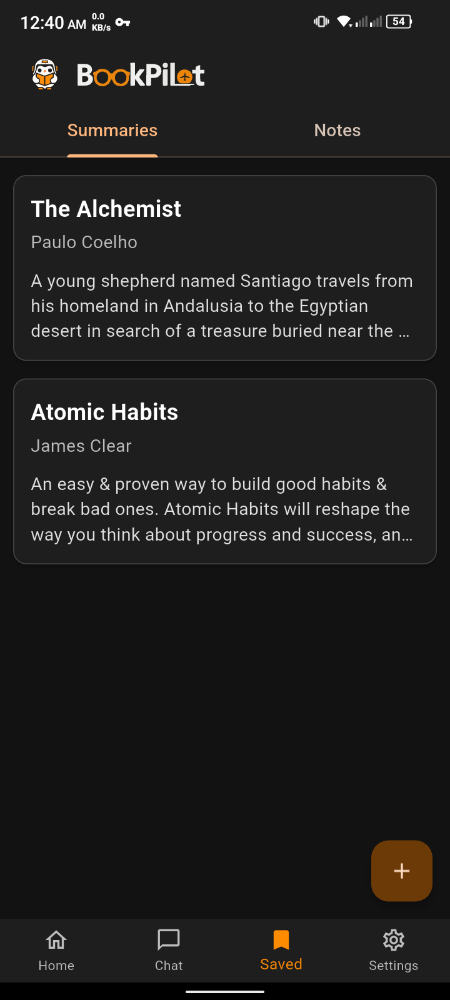
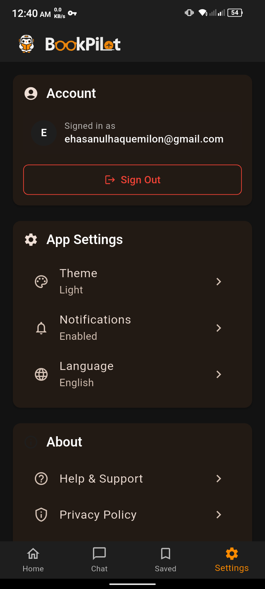

# BookPilot
BookPilot is a AI Powered Book Summary App. Where You can get 1000+ books summary for free, Chat With books, Take notes and BookMark Summaries.

Name convention Kebab-case, all lowercase

# Data Model

## book_manifest.json
```json
{
  "books": [
    {
      "id": "atomic-habits",
      "title": "Atomic Habits",
      "author": "James Clear",
      "publicationDate": "2018-10-16",
      "description": "An easy and proven way to build good habits and break bad ones.",
      "tags": ["Self-help", "Personal Development", "Psychology"],
      "coverImageUrl":"",
      "coverImagePath": "books/atomic-habits/cover.png",
      "summariesPath": { 
        "en": "books/atomic-habits/summary.md",
        "bn": "books/atomic-habits/summary-bn.md"
      },
      "isbn": "",
      "updatedAt": "2024-01-01T00:00:00.000Z",
      "version": "1.0.0"
    }
  ],
  "lastUpdated": "2024-01-08T12:00:00.000Z"
}

```

# Screenshots

<table>
  <tr>
    <td></td>
    <td></td>
  </tr>
  <tr>
    <td></td>
    <td></td>
  </tr>
  <tr>
    <td></td>
    <td></td>
  </tr>
  <tr>
    <td></td>
    <td></td>
  </tr>
  <tr>
    <td></td>
    <td></td>
  </tr>
</table>


